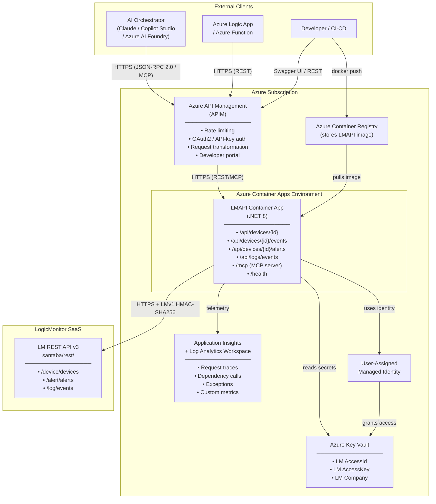
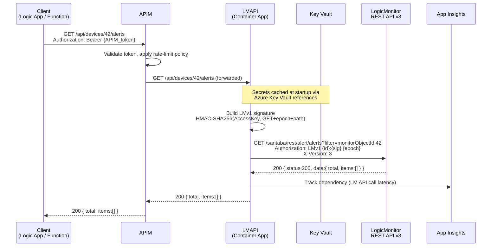
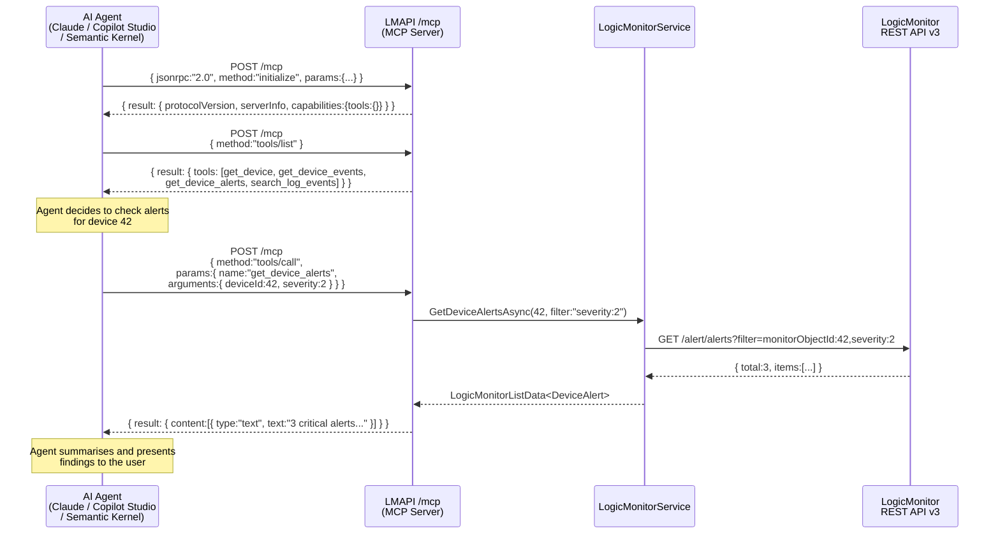
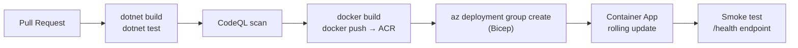

# LMAPI — Azure Architecture & Data Flow

## Overview

LMAPI is a .NET 8 Web API gateway that wraps the **LogicMonitor REST API v3**.  
When deployed on Azure it sits behind **Azure API Management (APIM)** and can be
consumed by any **MCP-compatible orchestrator** (e.g. Claude Desktop, Azure AI Foundry,
Copilot Studio, a custom Semantic Kernel agent) or called directly from an
**Azure Logic App / Azure Function** workflow.

---

## 1. Azure Deployment Topology



---

## 2. Request Data Flow — REST (direct / via Logic App)



---

## 3. MCP / Orchestrator Data Flow



---

## 4. Azure Components Reference

| Component | SKU / Config | Purpose |
|---|---|---|
| **Azure Container Apps** | Consumption plan | Hosts LMAPI; auto-scales to zero; no infrastructure to manage |
| **Azure API Management** | Developer / Standard | Rate-limit, OAuth2/API-key auth, developer portal, request tracing |
| **Azure Key Vault** | Standard | Stores LM `AccessId`, `AccessKey`, `Company` as secrets; accessed via Managed Identity — no secrets in config files or environment variables |
| **Application Insights** | Workspace-based | Distributed tracing, dependency tracking (LM API call latency), exceptions, custom metrics |
| **Log Analytics Workspace** | Pay-per-GB | Backend store for App Insights telemetry |
| **Azure Container Registry** | Basic | Stores the LMAPI Docker image; geo-replicated for HA |
| **User-Assigned Managed Identity** | — | Grants the Container App identity-based access to Key Vault (no stored credentials) |

---

## 5. Security Model

```
┌─────────────────────────────────────────────────────────────────┐
│  APIM (perimeter)                                               │
│  • Mutual TLS on inbound (optional)                             │
│  • JWT / subscription-key validation                            │
│  • IP allow-listing for orchestrator IPs                        │
└────────────────────────┬────────────────────────────────────────┘
                         │ Internal VNET / Private Endpoint
┌────────────────────────▼────────────────────────────────────────┐
│  LMAPI Container App                                            │
│  • HTTPS only (managed cert)                                    │
│  • Reads secrets from Key Vault via Managed Identity            │
│  • LMv1 HMAC-SHA256 signs every outbound LM API call           │
│  • No secrets in appsettings / environment variables            │
└────────────────────────┬────────────────────────────────────────┘
                         │ Outbound to LogicMonitor SaaS
                         │ (HTTPS, egress via NAT Gateway)
                         ▼
               LogicMonitor REST API v3
```

---

## 6. MCP Tool Manifest

The `/mcp` endpoint implements the [Model Context Protocol](https://modelcontextprotocol.io)
JSON-RPC 2.0 server spec.  Any MCP-compatible client can discover and invoke the
following tools:

| Tool Name | Maps To | Description |
|---|---|---|
| `get_device` | `GET /api/devices/{id}` | Return full details for a LogicMonitor device |
| `get_device_events` | `GET /api/devices/{id}/events` | Return paged events/logs for a device |
| `get_device_alerts` | `GET /api/devices/{id}/alerts` | Return active alerts for a device |
| `search_log_events` | `GET /api/logs/events` | Search LM Logs (Log Intelligence) |

### Connecting Claude Desktop

Add this block to `claude_desktop_config.json`:

```json
{
  "mcpServers": {
    "lmapi": {
      "url": "https://<apim-gateway-url>/mcp",
      "headers": {
        "Ocp-Apim-Subscription-Key": "<your-apim-subscription-key>"
      }
    }
  }
}
```

### Connecting Azure AI Foundry / Copilot Studio

Import the OpenAPI spec from `https://<apim-gateway-url>/swagger/v1/swagger.json`
as a **Custom Connector** or use the `/mcp` endpoint as an **MCP server** in an
Agent tool configuration.

---

## 7. CI/CD Pipeline (GitHub Actions — high level)



---

## 8. Key Vault Secret Names

| Key Vault Secret | maps to appsettings key |
|---|---|
| `lm-company` | `LogicMonitor__Company` |
| `lm-access-id` | `LogicMonitor__AccessId` |
| `lm-access-key` | `LogicMonitor__AccessKey` |
| `appinsights-connection-string` | `ApplicationInsights__ConnectionString` |
